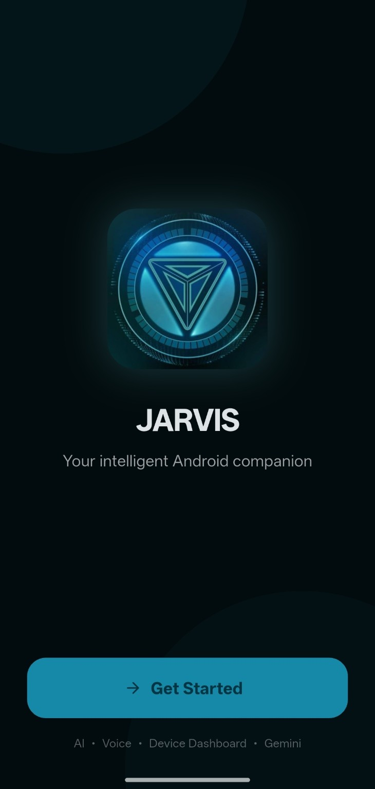
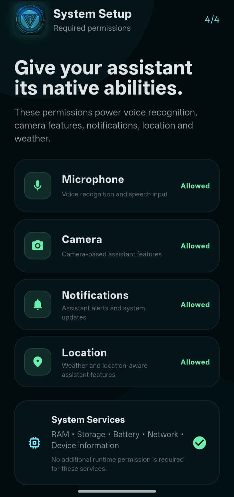
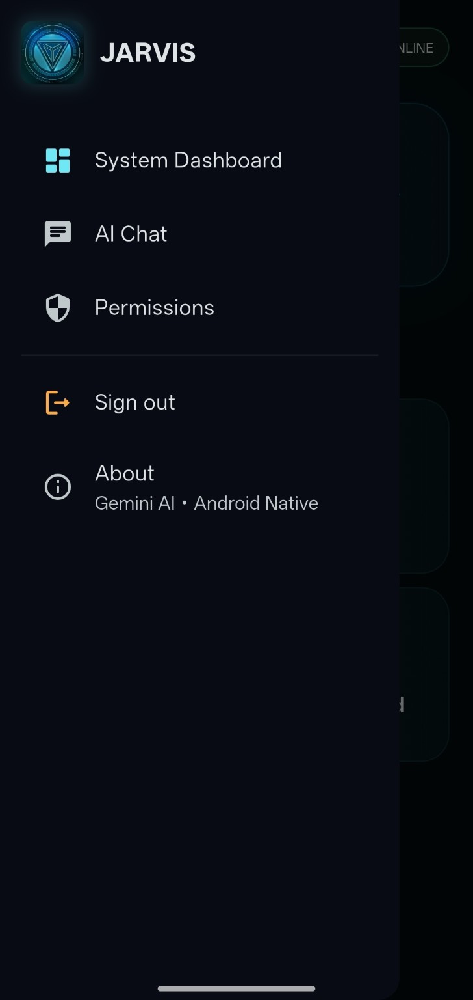
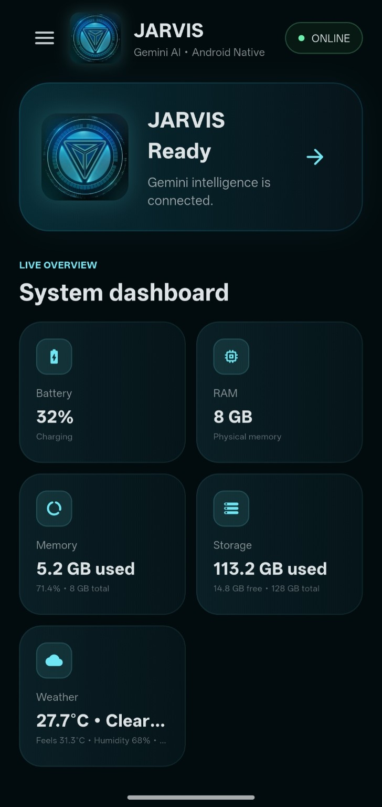
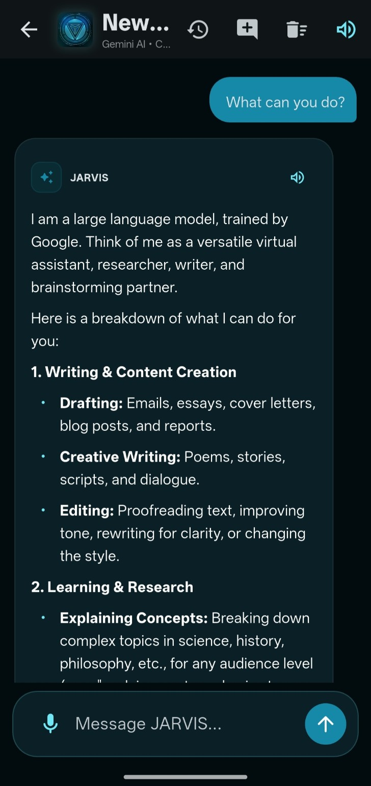

<div align="center">

# 🤖 JARVIS — AI System Assistant

### Your intelligent Android companion.

A futuristic AI assistant designed to combine **AI conversations, voice interaction, device information, permissions, and a modern system dashboard** in one Android experience.

<p>
  <a href="https://ai-system-assistant-8ae13.web.app/">🌐 Live Web App</a>
  •
  <a href="https://github.com/manikanth-katta/AI-System-Assistant/releases">📦 Download APK</a>
  •
  <a href="https://github.com/manikanth-katta/AI-System-Assistant">⭐ GitHub Repository</a>
</p>

</div>

---

## ✨ Overview

**JARVIS — AI System Assistant** is a personal AI companion built to feel less like a traditional chatbot and more like a **digital system assistant**.

The application combines an AI chat experience with Android-native capabilities such as:

- 🎙️ Voice input
- 🔊 AI response playback
- 🧠 Gemini-powered conversations
- 📊 Live device/system information
- 🔋 Battery monitoring
- 💾 RAM and storage information
- 🌦️ Weather information
- 📷 Camera-related capabilities
- 🔔 Notification permissions
- 📍 Location-aware features
- 🛡️ Permission management
- 🎨 Futuristic dark UI

> **Project status:** Actively evolving. More assistant, automation, memory, and device-control capabilities are planned.

---

## 📱 Screenshots

### Welcome



### System Setup



### Navigation



### System Dashboard



### AI Chat



---

## 🧠 What JARVIS Can Do

| Capability | Description |
|---|---|
| 🤖 AI Chat | Interact with an AI assistant using natural language |
| 🎙️ Voice | Use microphone input for assistant interaction |
| 🔊 Text-to-Speech | Listen to assistant responses |
| 📊 System Dashboard | View important device information |
| 🔋 Battery | Monitor battery state |
| 🧠 RAM | View memory usage |
| 💾 Storage | View used and available storage |
| 🌦️ Weather | Display weather information |
| 🛡️ Permissions | Manage assistant-related permissions |
| 📷 Camera | Support camera-based assistant features |
| 🔔 Notifications | Support notification-aware functionality |
| 📍 Location | Enable location-aware features |

---

## 🏗️ Project Architecture

```text
                    ┌─────────────────────┐
                    │       JARVIS        │
                    │   AI System App     │
                    └──────────┬──────────┘
                               │
              ┌────────────────┼────────────────┐
              │                │                │
              ▼                ▼                ▼
        ┌───────────┐    ┌────────────┐   ┌─────────────┐
        │ AI / Chat │    │ Android    │   │ System      │
        │           │    │ Services   │   │ Dashboard   │
        └─────┬─────┘    └─────┬──────┘   └──────┬──────┘
              │                │                │
              ▼                ▼                ▼
          Gemini AI       Permissions      Device APIs
```

---

## 🛠️ Technology Stack

### Application

- **Flutter / Dart** — Android application development
- **Android native capabilities** — device and permission integration

### AI

- **Google Gemini** — conversational AI

### Web

- **React**
- **Vite**
- **Firebase Hosting**

### Development

- Git
- GitHub
- Android tooling

---

## 🚀 Getting Started

### Web application

Clone the repository:

```bash
git clone https://github.com/manikanth-katta/AI-System-Assistant.git
cd AI-System-Assistant
```

Install dependencies:

```bash
npm install
```

Start the development server:

```bash
npm run dev
```

Open the local URL provided by Vite.

### Android application

The latest Android build can be published through the repository's **GitHub Releases** section.

> Never commit private API keys, service-account credentials, signing keys, or other secrets to the repository.

---

## 🌐 Live Demo

Try the web version:

**https://ai-system-assistant-8ae13.web.app/**

---

## 🗺️ Roadmap

### ✅ Current

- [x] Futuristic JARVIS interface
- [x] Android application
- [x] AI chat
- [x] Gemini integration
- [x] Voice interaction
- [x] Text-to-speech
- [x] System dashboard
- [x] Battery information
- [x] RAM information
- [x] Storage information
- [x] Weather
- [x] Permission setup

### 🔄 Next

- [ ] Wake-word activation
- [ ] Persistent assistant memory
- [ ] Conversation history improvements
- [ ] More Android system actions
- [ ] Advanced notification interaction
- [ ] Custom assistant personality
- [ ] Better offline capabilities
- [ ] AI-powered device automation
- [ ] Expanded tool/agent system

---

## 🔐 Security

JARVIS may require access to Android capabilities such as:

- Microphone
- Camera
- Notifications
- Location

Permissions are requested during setup and should only be granted when required.

**Important:** Keep API keys and credentials outside source control. Use secure configuration methods for production builds.

---

## 🎯 Vision

The long-term goal is to evolve JARVIS from an AI chat application into a **personal AI agent for Android**.

```text
Chatbot
   ↓
Voice Assistant
   ↓
System Assistant
   ↓
AI Agent
   ↓
Personal Digital Companion
```

The project is being developed incrementally with the goal of combining **AI + voice + Android system capabilities + automation** into a single assistant.

---

## 👨‍💻 Developer

### Katta Venkata Manikanth

Computer Science & Engineering — Artificial Intelligence

Interested in:

- Artificial Intelligence
- Generative AI
- Android Development
- Cybersecurity
- Cloud & DevOps
- Software Engineering

---

## ⭐ Support the Project

If you find JARVIS interesting:

- ⭐ Star the repository
- 🐛 Report bugs
- 💡 Suggest features
- 🔀 Contribute improvements
- 📢 Share the project

---

<div align="center">

### 🤖 JARVIS — Building a smarter Android experience.

**Made with curiosity, AI, and a lot of experimentation.**

</div>
